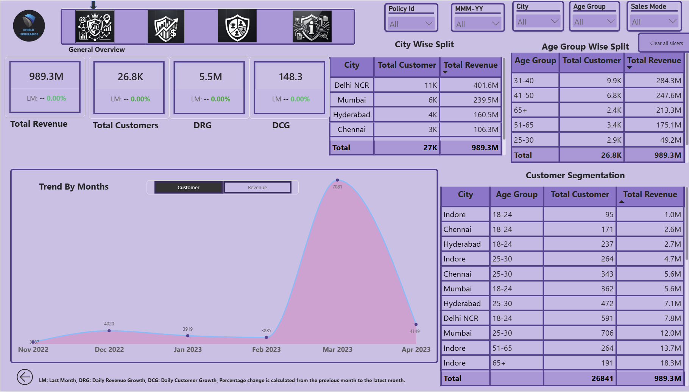
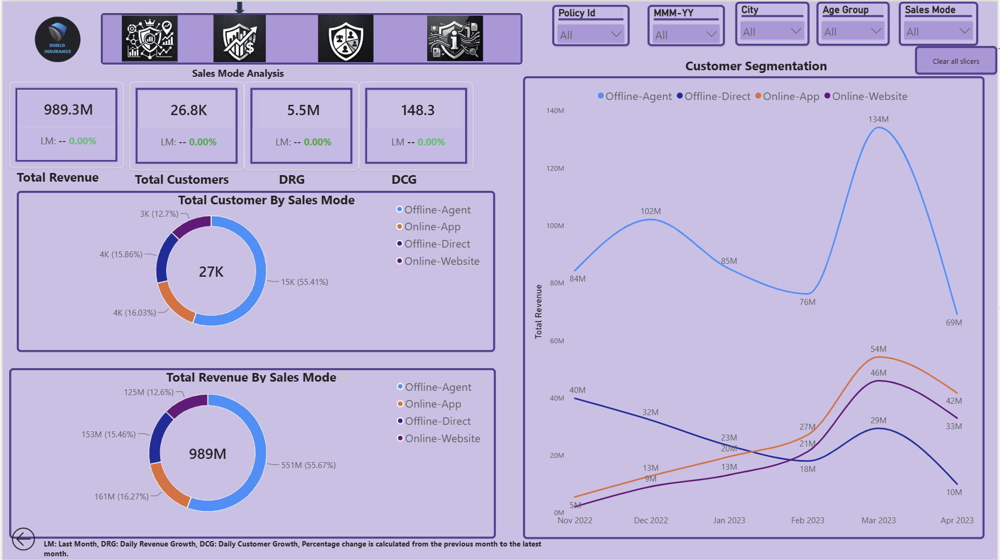
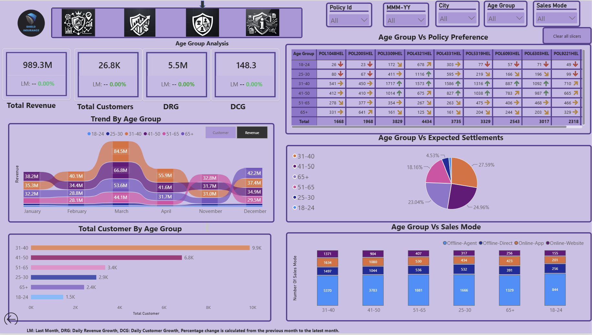
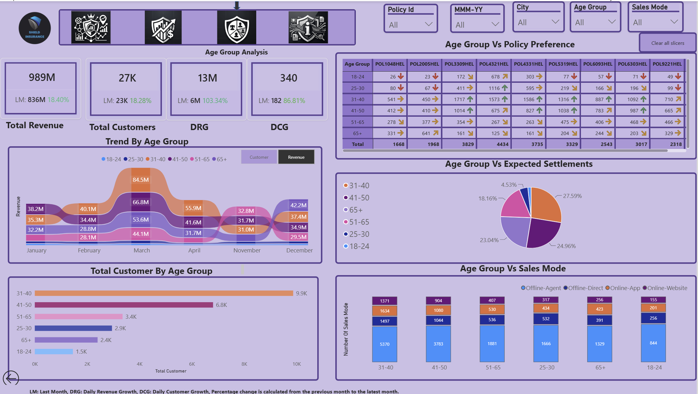
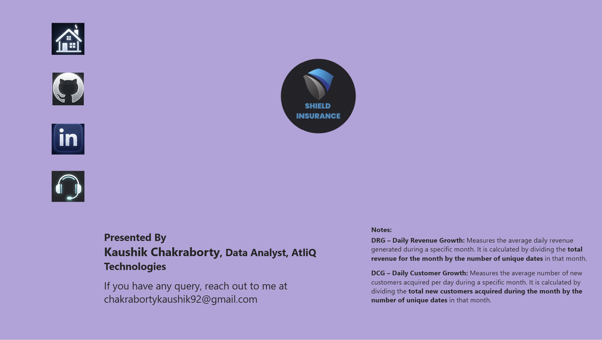

# Shield-Insurance-Power-BI-Project
**Shield Insurance** provides comprehensive insurance solutions for individuals and businesses, offering coverage designed to manage a wide range of risks. With a strong focus on customer service, protection, and reliable coverage, the company aims to provide customers with greater financial security and confidence.


# Shield-Insurance-Analysis
# 🛡️ Shield Insurance – Power BI Business Analytics Dashboard

## 📌 Project Overview

**Shield Insurance** aims to strengthen its data-driven decision-making by leveraging business intelligence to monitor key performance indicators, understand customer behavior, and identify growth opportunities.

As a **Proof of Concept (PoC)**, AtliQ Technologies was tasked with developing an interactive **Power BI dashboard** that demonstrates how Shield Insurance can transform raw insurance data into actionable business insights.

The project focuses on analyzing **revenue, customer growth, demographics, geographical performance, sales channels, policy preferences, and expected settlements** to support strategic decision-making.

---

## 🎯 Problem Statement

Shield Insurance requires a centralized analytical solution to:

* Monitor key business performance metrics.
* Track revenue and customer growth trends.
* Understand customer distribution across age groups and cities.
* Analyze sales-channel performance.
* Identify customer preferences across policies and sales modes.
* Analyze expected settlements across customer age groups.
* Provide actionable insights to support customer acquisition, retention, product strategy, and risk management.

---

# 🔍 ASK – Business Requirements

### Key Performance Metrics

The dashboard was designed to track:

* Total Customers
* Total Revenue
* Daily Revenue Growth
* Daily Customer Growth
* Month-over-Month (MoM) changes in key metrics

### Customer & Revenue Analysis

* Segment customers into:

  * 18–24
  * 25–30
  * 31–40
  * 41–50
  * 51–65
  * 65+
* Analyze total revenue by age group and city.
* Analyze total customers by age group and city.
* Track monthly customer trends.
* Track daily customer growth trends.
* Track monthly revenue trends.
* Track daily revenue growth trends.

### Interactive Dashboard Features

* Dynamic switch between **Revenue Trend** and **Customer Trend**.
* Interactive filters for:

  * Sales Mode
  * Age Group
  * City
  * Month
  * Policy ID

### Sales Mode Analysis

A dedicated sales-mode analysis page was created to evaluate:

* Customer distribution by sales mode.
* Revenue distribution by sales mode.
* Sales-mode trends over time.

### Age Group Analysis

A dedicated age-group analysis page was created to evaluate:

* Age Group vs. Expected Settlement
* Age Group vs. Sales Mode
* Age Group vs. Policy Preference

---

# 🛠️ Tools & Technologies

| Tool                | Purpose                                                 |
| ------------------- | ------------------------------------------------------- |
| **Microsoft Excel** | Initial data inspection and cleaning                    |
| **Power Query**     | Data transformation and preparation                     |
| **Power BI**        | Data modeling, visualization, and dashboard development |
| **DAX**             | Calculated columns and analytical measures              |
| **DAX Studio**      | DAX analysis and optimization                           |

---

# 📊 Dataset

The project uses five CSV files containing customer, policy, date, premium, and settlement information.

### Data Sources

```text
dim_customer.csv
dim_date.csv
dim_policies.csv
fact_premiums.csv
fact_settlements.csv
```

---

## 🗂️ Data Dictionary

### `dim_customer`

Contains customer-level information.

| Column          | Description                                 |
| --------------- | ------------------------------------------- |
| `customer_code` | Unique identifier assigned to each customer |
| `dob`           | Customer's date of birth                    |
| `city`          | Customer's city                             |

### `dim_date`

Contains date-related information at daily and monthly levels.

| Column     | Description             |
| ---------- | ----------------------- |
| `date`     | Date at daily level     |
| `mmm_yy`   | Date at monthly level   |
| `day_type` | Day of the week         |
| `week_no`  | Week number of the year |

### `dim_policies`

Contains policy-level information.

| Column                  | Description                               |
| ----------------------- | ----------------------------------------- |
| `policy_id`             | Unique identifier for each policy         |
| `base_cover`            | Base coverage amount of the policy        |
| `base_premium_amt(INR)` | Premium amount associated with the policy |

### `fact_premiums`

Contains information about policy purchases.

| Column                   | Description                           |
| ------------------------ | ------------------------------------- |
| `date`                   | Date on which the policy was sold     |
| `customer_code`          | Unique customer identifier            |
| `Policy_id`              | Unique policy identifier              |
| `sales_mode`             | Sales channel used to sell the policy |
| `final_premium_amt(INR)` | Final premium paid by the customer    |

### `fact_settlements`

Contains settlement information by customer age.

| Column         | Description                                                    |
| -------------- | -------------------------------------------------------------- |
| `age`          | Age of the policyholder                                        |
| `settlement %` | Percentage of policy settlements associated with the age group |

---

# 🧹 Data Cleaning & Transformation

Data preparation was performed using **Microsoft Excel and Power Query**.

### Key transformations

1. Removed empty columns from the `fact_settlements` table.
2. Split the `sales_mode` column in `fact_premiums` using `-` as the delimiter.
3. Created separate fields for:

   * Online/Offline Mode
   * Sales Medium
4. Renamed transformed columns for improved readability.
5. Reviewed and corrected data types across tables.
6. Converted settlement percentage values into the appropriate numerical format.
7. Created calculated columns and measures required for dashboard analysis.

---

# 🧩 Data Model

The Power BI data model follows a **star-schema-oriented structure**, with dimension tables connected to transactional fact tables.

### Core tables

```text
dim_customer
     │
     ├──────── fact_premiums ──────── dim_policies
     │
     └──────── fact_settlements

dim_date ───────── fact_premiums
```

> **Data Model Screenshot:**
> Add your Power BI data-model image here.


---

# 📐 Key Metrics

### DRG (Daily Revenue Growth):

 Calculated by dividing the revenue generated on the latest available date by the revenue generated on the corresponding date of the previous month.

### DCG (Daily Customer Growth):

 Calculated by dividing the customer count on the latest available date by the customer count on the corresponding date of the previous month.

These metrics help identify short-term changes in revenue performance and customer acquisition.

---

# 🧮 DAX Calculations

## Calculated Columns

### Customer Age

```DAX
age =
DATEDIFF(
    dim_customer[dob],
    TODAY(),
    YEAR
)
```

### Customer Age Group

```DAX
age_group =
SWITCH(
    TRUE(),
    dim_customer[age] >= 18 && dim_customer[age] <= 24, "18-24",
    dim_customer[age] >= 25 && dim_customer[age] <= 30, "25-30",
    dim_customer[age] >= 31 && dim_customer[age] <= 40, "31-40",
    dim_customer[age] >= 41 && dim_customer[age] <= 50, "41-50",
    dim_customer[age] >= 51 && dim_customer[age] <= 65, "51-65",
    dim_customer[age] > 65, "65+",
    "Other"
)
```

### Settlement Percentage

```DAX
settlement_in_decimal =
RELATED(fact_settlements[settlement %])
```

---

# 📊 Core Measures

### Total Customers

```DAX
total_customer =
DISTINCTCOUNT(dim_customer[customer_code])
```

### Total Revenue

```DAX
total_revenue =
SUM(fact_premiums[final_premium_amt(INR)])
```

### Customer Change %

```DAX
customer_chg % =
DIVIDE(
    [total_customer] - [customer_lastmonth],
    [customer_lastmonth],
    0
)
```

### Previous Month Customers

```DAX
customer_lastmonth =
CALCULATE(
    [total_customer],
    DATEADD(dim_date[date], -1, MONTH)
)
```

### Daily Customer Growth Rate

```DAX
daily_customer_growth_rate =
VAR previous_day_customer_count =
    CALCULATE(
        [total_customer],
        DATEADD(dim_date[date], -1, DAY)
    )
RETURN
    DIVIDE(
        [total_customer] - previous_day_customer_count,
        previous_day_customer_count,
        0
    )
```

### Daily Revenue Growth Rate

```DAX
daily_revenue_growth_rate =
VAR previous_day_revenue =
    CALCULATE(
        [total_revenue],
        DATEADD(dim_date[date], -1, DAY)
    )
RETURN
    DIVIDE(
        [total_revenue] - previous_day_revenue,
        previous_day_revenue,
        0
    )
```

### Expected Settlement

```DAX
excepted_settlement =
ROUND(
    SUMX(
        fact_premiums,
        fact_premiums[final_premium_amt(INR)]
            * (1 + RELATED(dim_customer[settlement_in_decimal]))
    ),
    0
)
```

### Latest Day Customer Count

```DAX
latest_day_customer =
VAR maxdate =
    MAX(dim_date[date])
RETURN
    CALCULATE(
        [total_customer],
        dim_date[date] = maxdate
    )
```

### Latest Day Revenue

```DAX
latest_day_revenue =
VAR maxdate =
    MAX(dim_date[date])
RETURN
    CALCULATE(
        [total_revenue],
        dim_date[date] = maxdate
    )
```

### Revenue Change %

```DAX
revenue_chg % =
DIVIDE(
    [total_revenue] - [revenue_lastmonth],
    [revenue_lastmonth],
    0
)
```

### Previous Month Revenue

```DAX
revenue_lastmonth =
CALCULATE(
    [total_revenue],
    DATEADD(dim_date[date], -1, MONTH)
)
```

### Revenue Share by Age Group

```DAX
revenue_share_by_age_group =
DIVIDE(
    [total_revenue],
    CALCULATE(
        [total_revenue],
        ALL(dim_customer[age_group])
    ),
    0
)
```

---

# 📈 Dashboard Features

## 1. Executive Overview

The overview page provides a high-level view of:

* Total Revenue
* Total Customers
* Daily Revenue Growth
* Daily Customer Growth
* MoM Revenue Growth
* MoM Customer Growth
* Revenue trends
* Customer trends
* Age-group performance
* City-level performance

---

## 2. Sales Mode Analysis

The sales-mode page provides insights into:

* Customer distribution by sales mode.
* Revenue contribution by sales mode.
* Monthly sales-mode trends.
* Offline vs. online channel performance.
* Agent, Direct, App, and Website performance.

---

## 3. Age Group Analysis

The age-group page analyzes:

* Revenue by age group.
* Customer distribution by age group.
* Expected settlements by age group.
* Sales-mode preferences by age group.
* Policy preferences by age group.

---

# 🔄 Interactive Dashboard

The dashboard includes a **dynamic visual switch** that allows users to toggle between:

**Revenue Trend ↔ Customer Trend**

Additional slicers allow users to dynamically analyze the data by:

* Sales Mode
* Age Group
* City
* Month
* Policy ID

---

# 📸 Dashboard Screenshots

### Home Page

```markdown

```

### General Overview

```markdown

```

### Sales Mode Analysis

```markdown

```

### Age Group Analysis

```markdown

```

### Info

```markdown

```


> Replace the image paths above with the actual names of the screenshots in your GitHub repository.

---

# 💡 Key Metrics & Business Insights

### Overall Performance

* Shield Insurance generated approximately **₹989M in total revenue** and served approximately **27K customers**.
* The dashboard recorded a **Daily Revenue Growth (DRG) of ₹13M** and **Daily Customer Growth (DCG) of 340**, based on the project's defined metrics.

### Customer & Age Group Insights

* The **31–40** age group is the largest revenue-contributing segment, generating approximately **$284.3M** from **9.9K customers**.
* The **65+** segment generated approximately **$213.3M** despite having a comparatively smaller customer base of **2.4K**, indicating substantial revenue contribution from this segment.

### Geographical Insights

* **Delhi NCR** is the leading market, generating approximately **$401.6M** in revenue from **11K customers**.
* **Mumbai** contributed approximately **$239.5M** from **6K customers**.
* **Hyderabad** and **Chennai** contributed approximately **$160.5M** and **$106.3M**, respectively.

### Revenue Trend

* Monthly revenue reached a peak of approximately **$264M in March 2023**.
* Revenue subsequently declined by approximately **$121M month-over-month** leading into April 2023, highlighting significant revenue volatility.

### Customer Acquisition Trend

* Customer acquisition peaked at **7,081 customers in March 2023**.
* This represented a substantial increase compared with **3,885 customers in February 2023**.

### Sales Channel Performance

Agent-led sales represent the largest share of the sales mix:

| Sales Mode | Revenue Share |   Revenue |
| ---------- | ------------: | --------: |
| Agent      |    **55.67%** | **$551M** |
| App        |    **16.27%** | **$161M** |
| Direct     |    **15.46%** | **$153M** |
| Website    |    **12.60%** | **$125M** |

The results indicate a strong reliance on agent-led sales while digital channels provide additional opportunities for customer engagement.

### Expected Settlement Insights

* The **31–40** age group accounts for the largest share of expected settlements at **27.59%**.
* The **18–24** age group accounts for the lowest share at **1.73%**.
* Settlement patterns across age groups can be used to support risk monitoring and policy strategy.

---

# 🎯 Strategic Recommendations

### 1. Customer Growth & Stability

Leverage predictive analytics to anticipate revenue fluctuations and develop targeted strategies to increase engagement among the **18–24 and 65+** customer segments.

### 2. Age Group Strategy

Strengthen retention and engagement initiatives for the **31–40** segment through tailored products and customer offerings.

### 3. Geographical Expansion

Analyze successful strategies in **Delhi NCR** and evaluate their applicability to other major markets such as **Mumbai and Chennai**.

### 4. Sales Channel Optimization

Enhance the **App and Website** experience to improve engagement among younger customers who demonstrate greater adoption of digital channels.

### 5. Policy & Risk Management

Use settlement patterns across key age groups, particularly **31–40, 25–30, and 41–50**, to inform policy design, pricing, and risk-monitoring strategies.

### 6. Product & Channel Strategy

Align product offerings and sales channels with age-group preferences and customer behavior to improve engagement and optimize multi-channel performance.

---

# 🚀 Business Value

This Power BI solution demonstrates how insurance organizations can move from raw transactional data to actionable business intelligence by:

* Centralizing critical KPIs.
* Identifying high-value customer segments.
* Monitoring revenue and customer growth.
* Understanding geographical performance.
* Evaluating sales-channel effectiveness.
* Identifying demographic patterns.
* Supporting policy and risk-management decisions.
* Enabling interactive, self-service analysis.

---

# 📚 Key Skills Demonstrated

**Power BI** • **DAX** • **Power Query** • **Data Modeling** • **Data Cleaning** • **Business Intelligence** • **KPI Development** • **Customer Segmentation** • **Trend Analysis** • **Sales Analysis** • **Risk Analysis** • **Data Visualization** • **Business Storytelling**

---

# 🔗 Project Links

### 📊 Live Power BI Dashboard

**[View Live Dashboard](ATTACHED_LINK)**

### 🎥 Project Presentation

**[Watch Video Presentation](VIDEO_LINK)**

---

# 👨‍💻 Project Context

**Project:** Shield Insurance – Power BI Analytics Dashboard
**Project Type:** Proof of Concept (PoC)
**Domain:** Insurance / Financial Services
**Primary Tool:** Microsoft Power BI
**Supporting Tools:** Excel, Power Query, DAX Studio
**Role:** Data Analyst / Business Intelligence Analyst
